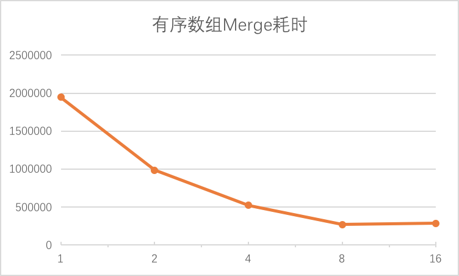
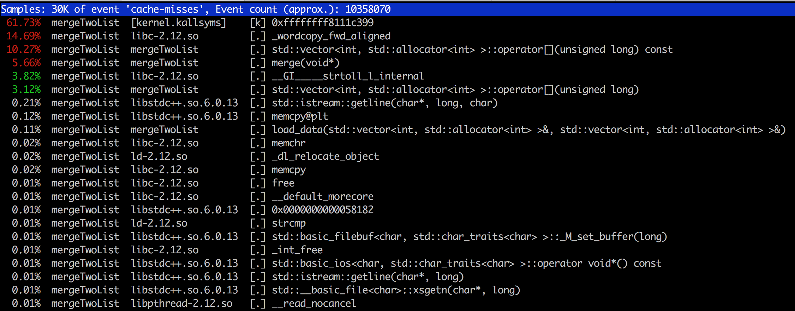

## 多线程Merge性能统计
### 测试机器
```
CPU 8核，2.60GHz，宿主机，KVM虚拟化
```
### 数据准备
```
执行./prepareData 20000000 80000000
表示生成2个有序数组，数组长度分别为2KW 和 8KW
```

### 测试性能数据

```
一个进程merge耗时   1944901  微秒
两个线程merge耗时   984138   微秒  相对单进程提高49%  
四个线程merge耗时   521818   微秒  相对单进程提高73%  
八个线程merge耗时   268360   微秒  相对单进程提高86%  
十六个线程merge耗时 281368   微秒  相对八线程降低4.8%  
```
### 图表



### 一些性能注意点：
merge函数里的value要使用resize，并且覆盖值，否则会引起Cache False Sharing问题，因为vector size是局部变量，每次插入都需要更新，导致多线程性能很差，甚至不如单线程性能高。

### perf report
